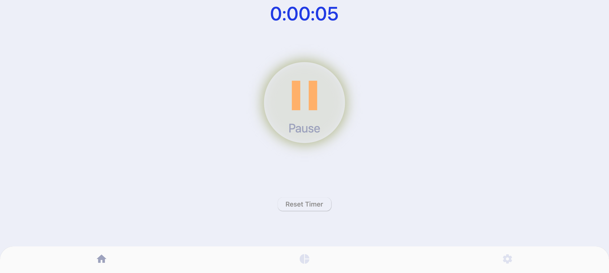

# Timer & IP Info Flutter App (May 2024)

[Live Demo](https://timer-ip-flutter.web.app/)

This Flutter application features three distinct pages, each offering a unique functionality. The app is fully responsive and adapts seamlessly to different screen sizes, making it accessible on both mobile devices and desktops.

## Features

### Page 1: Animated Timer
The first page includes a **bright, animated timer** with real-time counting. It allows users to:

- Start the timer
- Stop the timer
- Reset the timer

The animation is smooth, providing visual feedback for each second counted. It is designed to be simple yet visually appealing for ease of use.

---

### Page 2: IP-based Map & Info
The second page uses the device’s **IP address** to display a map of the user’s location. Alongside the map, there's an animated string that provides **information about the country and city** associated with the IP address.

- Interactive map centered on the user’s location
- Animated text showing city and country
- Responsive layout adapting to different screen sizes

---

### Page 3: Adaptive Image Gallery with Language Translation
The third page features an **adaptive image gallery** powered by an open API. Users can browse the gallery and also switch between **English and German** language options for the interface.

- Dynamic gallery with images loaded from an open API
- Language translation feature for both English and German
- Smooth navigation through images with a clean, responsive layout

  
  

---

## Technologies Used

- **Flutter**: Cross-platform framework to build the app for both web and mobile platforms.
- **Google Maps API**: Used to display the interactive map based on the user’s IP address.
- **Open API for images**: Provides images dynamically for the gallery section.
- **IP Location API**: Fetches location data using the device's IP address.
- **Responsive Design**: Ensures the app adapts to different screen sizes on mobile and desktop.

## How to Use

1. **Timer Page**: Start, stop, or reset the timer to keep track of time visually.
2. **Map Page**: Automatically shows your location on the map based on your device’s IP, and provides information about the country and city.
3. **Gallery Page**: Browse through a gallery of images, and toggle between English and German for the UI language.

 ## Author
 
Made with 🧡 by [Olexandra Kunytska](https://github.com/olexandracodes)
